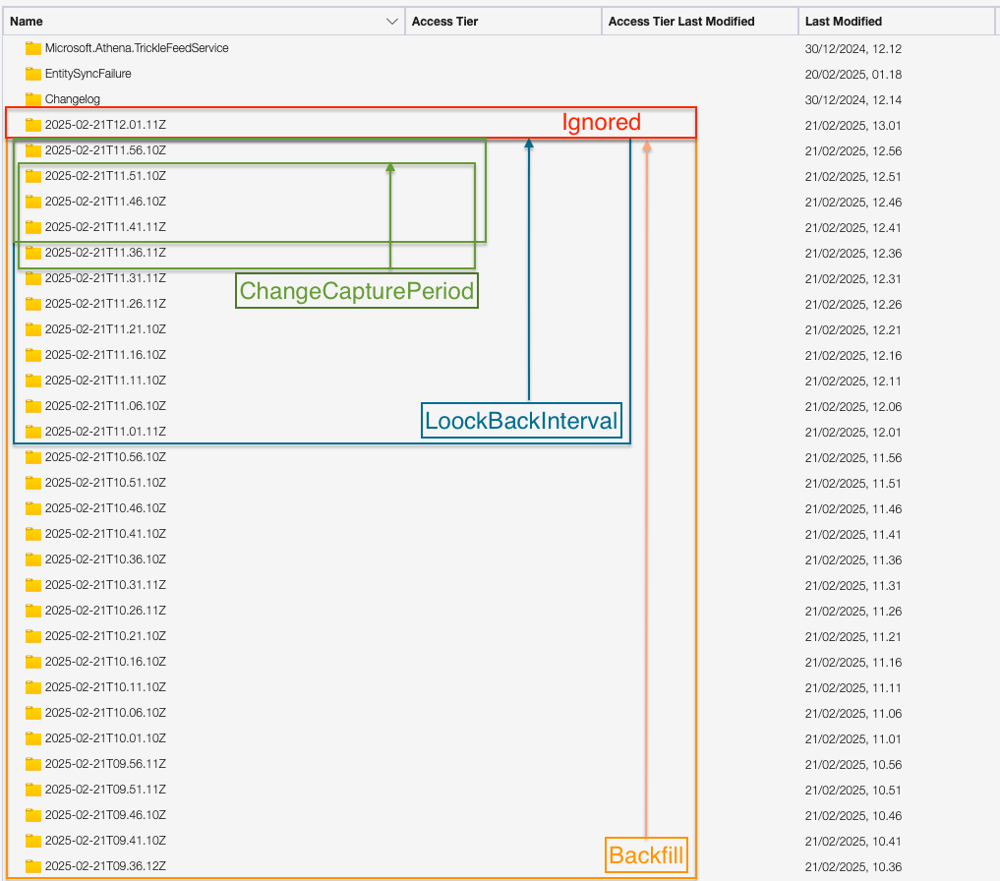

# Backfilling and schema evolution data with the Synapse Link Arcane plugin

## Schema evolution

Since the data produced by the Dynamics 365 export mechanism has the incremental folder structure, the backfilling
process is similar to other Arcane plugins, but has some specifics.

The `MicrosoftSynapseLink` Arcane plugin performs the schema evolution in the following way:

1. During the reading change feed, plugin uses the `<timestamp>/model.json` to determine the schema of the change set.
 
2. The extracted schema is used to parse CSV file.
 
3. When the set of rows is grouped to the batch, the plugin groups rows by the schema and writes each group to the separate
   staging table.
 
4. Before merging from the staging table to the final table, the plugin checks the schema of the final table and compares it
   with the schema of the staging table. If a column is missing in the final table, the plugin adds it to the final table.
 
5. When the schema evolution process is completed, the plugin merges the data from the staging table to the final table.
 
6. The process with the archive table is the same.

## Backfilling

Since the `MicrosoftSynapseLink` Arcane plugin can perform the schema evolution described above, it does not need
to initiate the backfilling process on the schema change event.

Nevertheless, the plugin can be configured to backfill the data from the very first folder in the storage account.
It can be helpful if the stream runner was offline for a long time, if some of the dropped files were missed,
or if the new table was added.

The job templates used for backfilling process has more resources than a regular job template and runs on the public
node pool bypassing the configured proxy which also speeds up the process.

> [!IMPORTANT]  
> The backfill reads the data from beginning of the storage account, not the source table in D365.
> If you need to **replace** target table, make sure that the export of the source table was reinitialized before starting
> the backfill process.

### Backfill behavior

The backfill can work in two modes:

- Create a new target table and then replace the old one with the SQL `CREATE OR REPLACE` statement.
- Create a new target table and update the old one with the SQL `MERGE` statement.

The mode is defined by the `.spec.backfillBehavior` parameter in the stream definition that can be set to `ovewrite` or `merge`.

> [!IMPORTANT]  
> The backfill reads the data from beginning of the storage account, not the source table in D365.
> If you need to **replace** target table, make sure that the export of the source table was reinitialized before starting
> the backfill process.

## Arcane time intervals

The Arcane stream definition has a set of parameters that define the time intervals for the streaming and backfilling
processes.

1. If the stream is running in backfill mode, it always reads the folders from the first one in the container.
2. When the job is started, in reads folders that created after `now() - loockBackIntervalSeconds`. This is needed to
   avoid data loss if the stream was offline for some time (for example, due to the spot node interruption).
   > [!WARNING]  
   > If the stream runner was offline more then the `lookBackIntervalSeconds`, the data will be lost.
   > 
   > This can be fixed with the backfill process with the `backfillBehavior` set to `merge`.
 
3. Every `.spec.changeCaputureIntervalSeconds` the stream reads the date form the `Changelog/changelog.info` file,
   subtracts the `.spec.changeCapturePeriod` from the timestamp and reads the data starting from this timestamp.
   > [!IMPORTANT]  
   > The changeCapturePeriod should be set to a value such that time windows **overlap** in every cycle.
   > The default value is `changeCaputureIntervalSeconds * 4` 

4. The most recent folder is always skipped to avoid reading the incomplete data.

See the diagram below for the visual representation of the time intervals.

